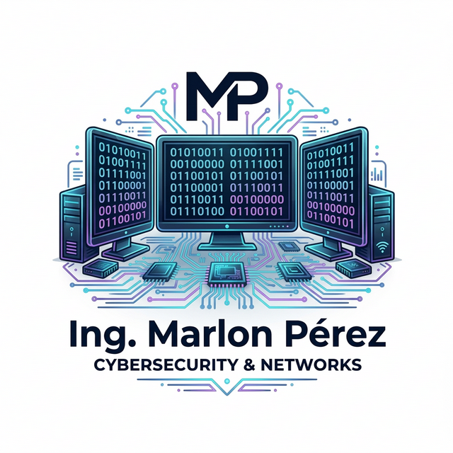

<div align="center">
  
  
  # 🚀 Ing. Marlon Pérez — Portfolio v2.0
  ### *Advanced Research & Cybersecurity Engineering Ecosystem*

  [](https://nextjs.org/)
  [](https://www.typescriptlang.org/)
  [](https://supabase.com/)
  [](https://groq.com/)
  [](https://vercel.com/)

  [Explorar Demo Live](https://ing-marlon-p-rez.vercel.app/) • [Investigación Científica](/investigacion) • [Reportar Bug](https://github.com/marlonperez70/Ing-Marlon-P-rez/issues)
</div>

---

## 📑 Resumen Ejecutivo
Este ecosistema digital no es solo un portafolio; es una **plataforma de ingeniería de alto rendimiento** diseñada para centralizar investigaciones científicas sobre **Inteligencia Artificial** y **Ciberseguridad**. Implementa una arquitectura moderna basada en microservicios de backend (Supabase) y procesamiento de lenguaje natural en el edge (Groq).

---

## ✨ Características Principales

| Característica | Descripción Técnica |
| :--- | :--- |
| 🧠 **AI Chatbot** | Integración nativa con **Llama 3** vía Groq SDK para respuestas técnicas en tiempo real. |
| 🛡️ **Bóveda de Seguridad** | Gestión dinámica de certificaciones mediante **Supabase Storage** y RLS (Row Level Security). |
| 🎬 **Multimedia Inmersiva** | Soporte de video inteligente (YouTube/TikTok) con lógica **Picture-in-Picture** en el scroll. |
| 📊 **Dashboard de Avances** | Visualización de progreso de investigaciones científicas con datos sincronizados en la nube. |
| ⚡ **SSR & SSG** | Optimización de carga mediante *Server-Side Rendering* para SEO y *Static Site Generation* para proyectos. |

---

## 🏗️ Evolución de Ingeniería (Roadmap)

### 🔹 Etapa 1: Core & Visual Identity
Establecimiento de los cimientos técnicos. Refactorización total del sistema de navegación global y saneamiento de políticas de seguridad. Implementación del diseño **Cyber-Premium** con *Glassmorphism* y animaciones de alto rendimiento mediante **Framer Motion**.

### 🔹 Etapa 2: Inteligencia Artificial Aplicada
Evolución de una UI estática a una interactiva. Desarrollo de un módulo de investigación que procesa metadatos dinámicos y ofrece una experiencia multimedia fluida, integrando masterclasses técnicas directamente en la interfaz de usuario.

### 🔹 Etapa 3: Ecosistema Cloud-Native
Migración total de activos a la nube. Configuración de **Supabase** como motor de datos relacional y repositorio de archivos críticos. Esta fase transformó el portafolio en un **Sistema de Gestión de Conocimiento (CMS)** dinámico y escalable.

---

## 🛠️ Stack Tecnológico

<details>
<summary><b>Ver detalles del Stack</b></summary>

- **Core:** Next.js 15 (App Router), React 19.
- **Lenguaje:** TypeScript (Tipado estricto).
- **Backend:** Supabase (Auth, DB, Storage).
- **IA:** Groq Cloud SDK (Llama 3 70B).
- **Diseño:** Tailwind CSS v4, Lucide Icons.
- **Animaciones:** Framer Motion (Orchestration).
</details>

---

## 📸 Galería del Proyecto

<div align="center">
  <table>
    <tr>
      <td width="50%">
        <p align="center"><b>Dashboard Principal</b></p>
        
      </td>
      <td width="50%">
        <p align="center"><b>Módulo de Investigación</b></p>
        
      </td>
    </tr>
    <tr>
      <td width="50%">
        <p align="center"><b>Bóveda de Documentos</b></p>
        
      </td>
      <td width="50%">
        <p align="center"><b>Asistente IA</b></p>
        
      </td>
    </tr>
  </table>
</div>

---

## 🚀 Instalación y Configuración Local

1. **Clonar el repositorio:**
   ```bash
   git clone https://github.com/marlonperez70/Ing-Marlon-P-rez.git
   cd Ing-Marlon-P-rez
   ```

2. **Instalar dependencias:**
   ```bash
   npm install
   ```

3. **Configurar variables de entorno (`.env.local`):**
   ```env
   NEXT_PUBLIC_SUPABASE_URL=tu_url
   NEXT_PUBLIC_SUPABASE_ANON_KEY=tu_clave
   SUPABASE_SERVICE_ROLE_KEY=tu_clave_secreta
   GROQ_API_KEY=tu_api_key_ia
   ```

4. **Ejecutar en desarrollo:**
   ```bash
   npm run dev
   ```

---

## 📡 Base de Datos
El esquema completo está disponible en `supabase-schema.sql`. La base de datos utiliza **RLS (Row Level Security)** para garantizar que la integridad de los datos esté protegida a nivel de protocolo.

---

## 📧 Contacto y Credenciales Académicas

<div align="left">
  <a href="mailto:malmachi@unemi.edu.ec">
    
  </a>
  <a href="https://orcid.org/0009-0001-9166-7497">
    
  </a>
  <a href="https://www.linkedin.com/in/ing-marlon-p%C3%A9rez-06ab32303">
    
  </a>
</div>

---
<p align="center">
  Construido con ❤️ por Ing. Marlon David Pérez Almachi. © 2026.
</p>
